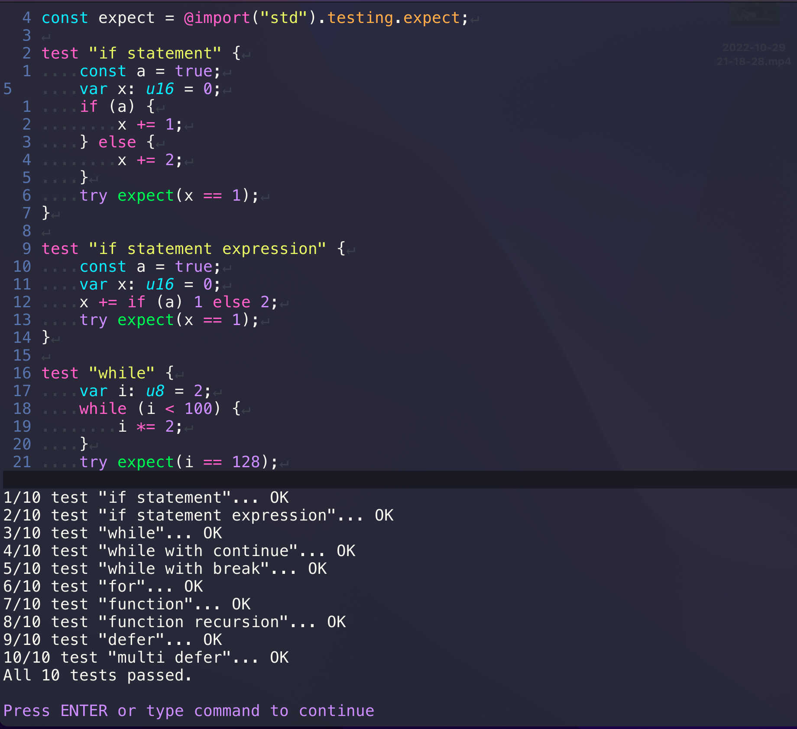
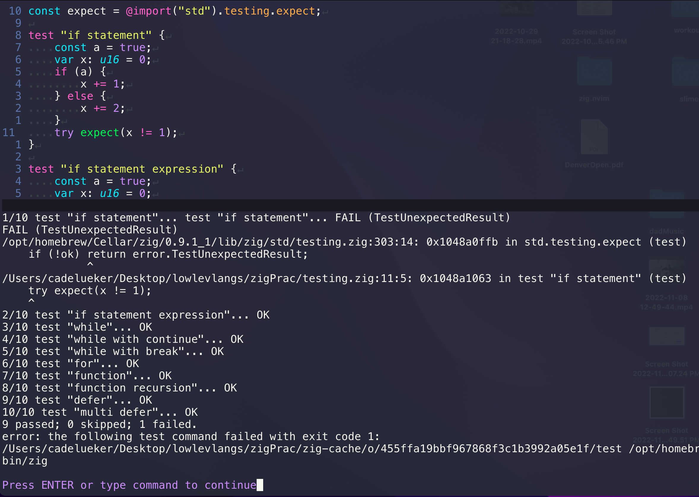
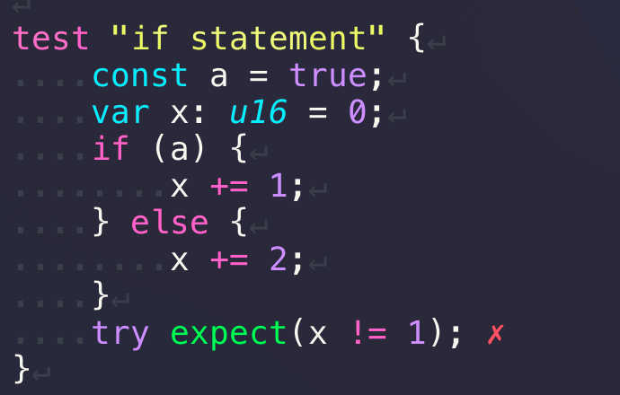

# Parody of zig-mode in emacs

## Similar functionality, very minimal (< 210 lines of lua)

## Setup 

- require for defaults, or set them before requiring with the following 

```lua
vim.g.zig_settings = {
  -- command to test file
  test = '<space>tf',
  -- command to build file
  build = '<space>bf',
  -- settings on save
  save = {format = true, build = false},
}
require('zig')
```
## Screen Shots

### Successful Test Run



### Failing Test Run

#### User Message



#### Virtual Text Insertion


